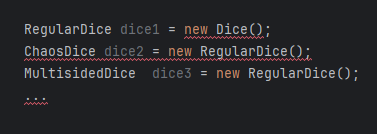

## Course 3: OOP Introduction
______

**ATTENTION:** When working with HSD lab computers, save ALL your work on the network drive (Dieser PC -> Netzwerkadressen)!!!

Any data stored on `C:\` will only be saved to the local computer and can be deleted or manipulated by any other user. 
______

*Note: (Currently German only)*

### Overview: "Einstieg in die Objektorientierung"
Im Rahmen dieses Versuchs sollen mehrere Klassen erstellt werden und darüber die vier Säulen der Objektorientierung anhand von praktischen Beispielen kennen gelernt werden.

Sämtlicher Code ist vor Ort zu programmieren. Eine inhaltliche Vorbereitung und vorherige Planung ist jedoch zwingend erforderlich um das Praktikum erfolgreich zu absolvieren.

Laden Sie das **Java Projekt** `dicegameTemplate` unter folgendem Link herunter: https://github.com/hsd-inflab/dicegameTemplate

Ziel des Praktikums ist das Füllen der Main-Klasse mit selbst erstellten Würfelobjekten. 
Bereits vorhanden sind:
1. Die Main Klasse
2. Die Abstrakte Oberklasse `Dice.java`, von der die zu erstellenden Würfelklassen abgeleitet werden sollen
3. Die Klasse `Shaker.java`, welche den Würfelbecher repräsentiert

Bevor Sie während des Praktikums mit der Implementierung starten: Besprechen Sie mit einem Betreuer eine geeignete Vererbungsstrategie und halten diese schriftlich fest. 
Die bereits vorhandenen Klassen `Dice` und `Shaker` dürfen nicht verändert werden.

Wenn Sie einen Würfel implementiert haben, fügen Sie diese in der Main-Methode dem Shaker mittels der `addDice(Dice dice)` Methode hinzu und überprüfen Sie die korrekte Funktion.
   
Nun sollen die folgenden vier Würfel von `Dice.java` abgeleitet werden:
1. `RegularDice.java`
   - normaler, sechsseitiger Würfel
2. `MultisidedDice.java`
   - mehrseitiger Würfel zwischen 4 und 20 Seiten
   - Seitenzahl kann nur bei Erstellung des Objekts festgelegt und danach nicht mehr geändert werden 
3. `LoadedDice.java`
   - gezinkter Würfel mit sechs Seiten
   - kann auf alle Seiten fallen, aber mit 50% Wahrscheinlichkeit auf die größte Zahl
4. `ChaosDice.java`
   - Würfel zwischen 4 und 20 Seiten
   - wechselt **nach** jedem Wurf die Seitenanzahl

Quelle: https://de.wikipedia.org/wiki/Spielwürfel

Fügen Sie in der Main Methode Sechs verschiedene Kombinationen aus Dateityp des Objekts und Konstruktorklasse und erklären, warum es möglich bzw. nicht möglich ist, diese so zu instanziieren. 

