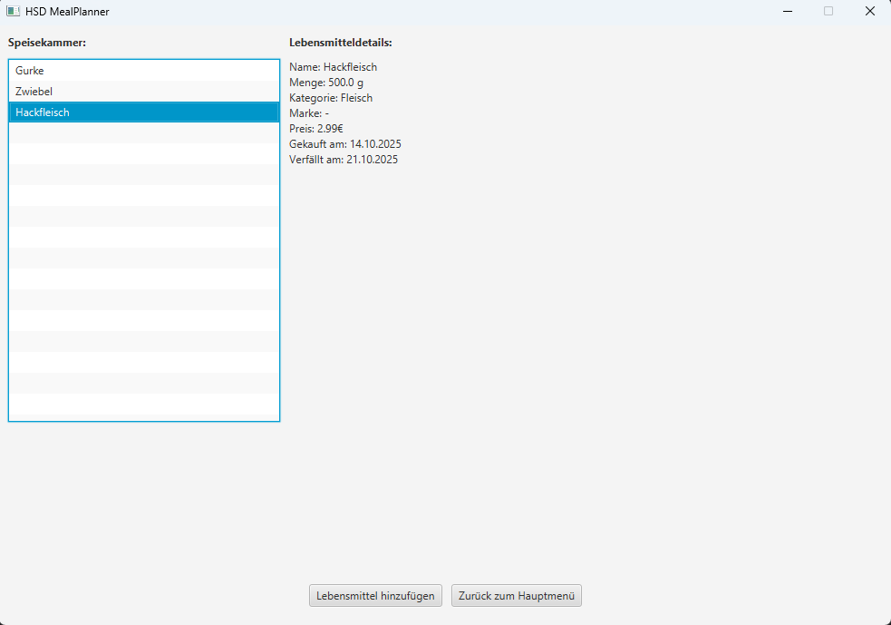

## Course 4: JavaFX
______

**ATTENTION:** When working with HSD lab computers, save ALL your work on the `H:\` drive!!!

Any data stored on `C:\` will only be saved to the local computer and can be deleted or manipulated by any other user. 
______

***This course requires a thorough preparation. make yourself familiar with the codebase in advance.***
### Topic

 Implementing a Java FX Graphical user interface (GUI) as a part of an existing project.

 The Simple Meal Planner is a JavaFX Application designed to keep track of your groceries and nutrition. Its main three components are:
 1. The recipe book: Here you can store all your recipes to have them ready whenever you wish to prepare them. there are functionalities for adding and editing recipes.
 2. The pantry: Stores all groceries in your home at one place so you can keep track on what you can cook. you may add groceries via a button.
 3. The Meal Planner: create your own individual meal plan, chosen from your recipes. you can also view which recipes you can prepare with your current pantry stock.

 Unfortunately there has been some corrupted data and the page that displays the pantry has been deleted. The entire dev-team is on vacation and customers are getting angry, so now it is your responsibility to get the application running the way it is supposed to. Despite the mishaps, there is at least a       picture of what the page is supposed to look like: 

 

### Tasks

1. Download the existing project from https://github.com/hsd-inflab/mealPlannerTemplate and open it in an editor of your choice, preferably VSCode when working in the HSD Lab.
2. Make yourself familiar with the codebase and how the JavaFX components are working together. Run the project and click through the JavaFX view while analyzing the code to figure out what each component does.
3. In the folder frontend/pages, create a new Class called `PantryPage.java` that inherits `Page` and contains a method `getView()` that returns the root as its return type. Inspiration on how this can be done may be obtained by analyzing already existing Page Classes.
4. The page shall be accessible by clicking on **Speisekammer verwalten** in the Main Menu. Uncomment the `navigator.register()` method in `MealPlannerFX.java` so that you can navigate to the new page. 
5. Behaviour of the page shall be as follows: On the left, list all items that are currently in the pantry. Upon clicking an item, its details shall be printed on the right side. The buttons **Lebensmittel hinzufügen** navigates to `AddGroceryPage`, **Zurück zum Hauptmenü** to `MainPage`.
6. The JavaFX Documentation is available under: https://openjfx.io/javadoc/17 . Relevant and useful JavaFX components are:
   - VBox
   - HBox
   - BorderPane
   - Label
   - ListView
   - Insets
   - Button
   - Node.setOnMouseClicked()
7. instead of `Button`, use `NavigationButton`.
8. Explain your code and all JavaFX components that you used in your solution.
9. Explain why Maven is used in this context and how it aids in software and application development.
   

 **IMPORTANT:** if you have Java 21 installed instead of Java 17 (you can check the version with `java --version` in the terminal),
   you need to set the javafx-controls dependency version to 20 inside pom.xml!

***IMPORTANT for Apple💻🍎 Mac M1/M2/M3 (not Intel!) users at home...***

   Change the javafx-controls dependency, to include

   `<classifier>mac-aarch64</classifier>`

   *after* the version tag, or the UI will not start and the app will crash!
    
<!--
### **FOR MAC OS USERS**

If your MacBook uses arm64 instead of x86-64 architecture, there might be an issue where JavaFX Application are not executed. To resolve this, perform the following steps:
1. Uninstall Java 17 and install Java 21
-->

